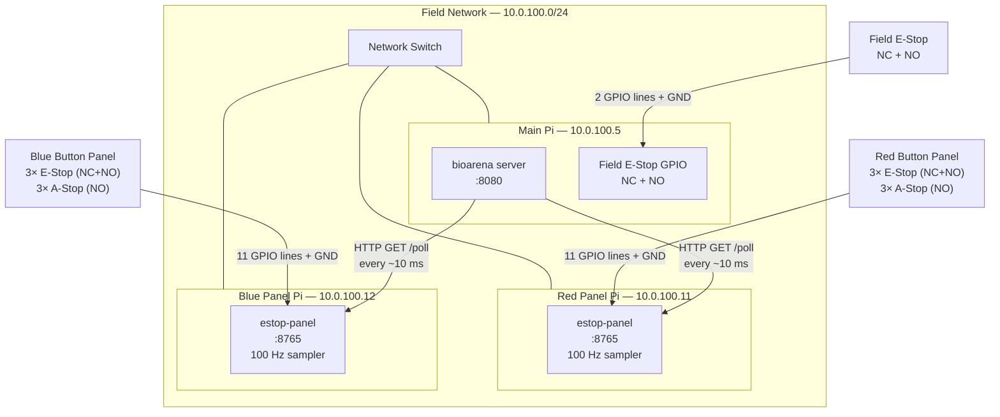
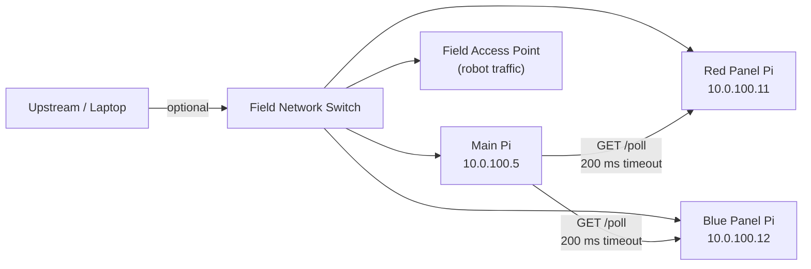
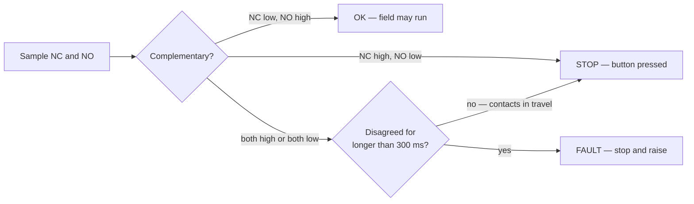
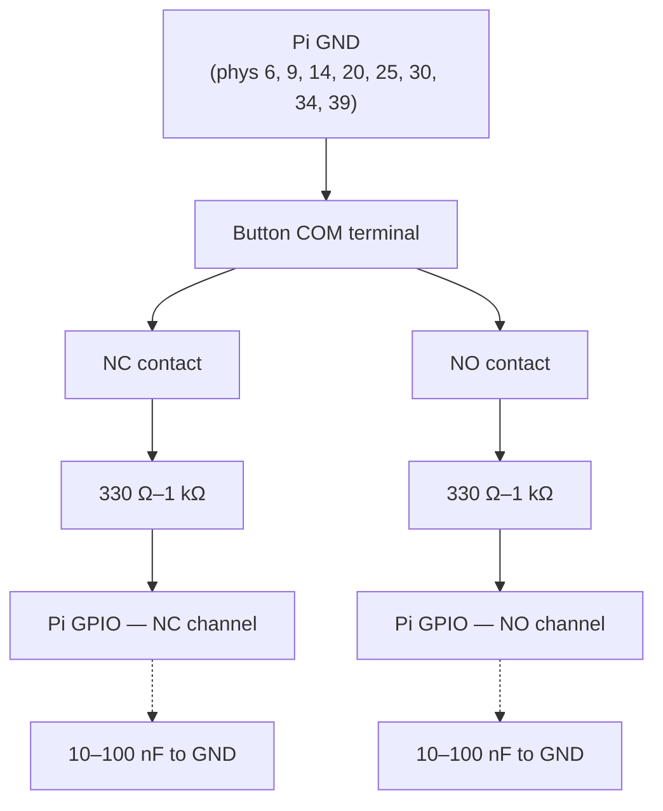
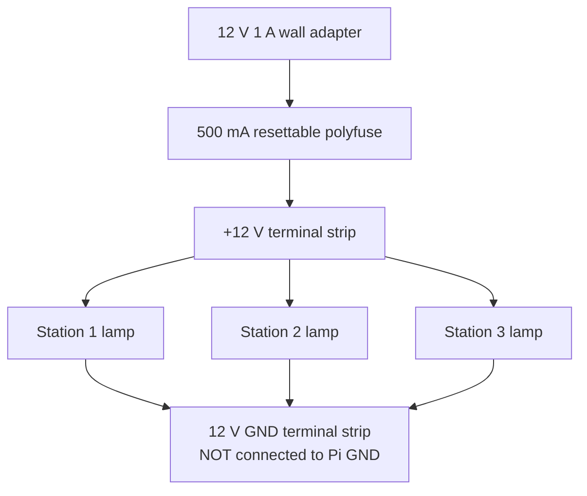

# Hardware Wiring Guide

This guide walks a first-time builder through wiring all field hardware: the main Pi, one panel Pi per alliance, and the button panels.

E-stop buttons are wired **dual-channel**: each button's NC and NO contacts return on separate conductors, so the field can tell the difference between a released button, a pressed button, and broken wiring. A-stops are single-channel.

---

## Contents

1. [System Overview](#1-system-overview)
2. [Bill of Materials](#2-bill-of-materials)
3. [Network Topology](#3-network-topology)
4. [How Dual-Channel Detection Works](#4-how-dual-channel-detection-works)
5. [Single Button Circuit](#5-single-button-circuit)
6. [Wiring an E-Stop Panel Pi](#6-wiring-an-e-stop-panel-pi)
7. [Main Pi Field E-Stop](#7-main-pi-field-e-stop)
8. [Power and Indicator Lamps](#8-power-and-indicator-lamps)
9. [Physical Panel Layout](#9-physical-panel-layout)
10. [Software Configuration](#10-software-configuration)
11. [Test Procedure](#11-test-procedure)
12. [Troubleshooting](#12-troubleshooting)

---

## 1. System Overview

Three Raspberry Pis connect through a network switch. The two panel Pis each handle one alliance's buttons; the main Pi polls them over HTTP and runs the arena server.



Two properties of this design are worth understanding before you cut any wire:

- **A wiring fault stops the field.** If the two channels of an e-stop disagree in a way that healthy wiring cannot produce, the arena treats that station as stopped and refuses to start a match until it clears.
- **An unreachable panel Pi is a fault, not silence.** A panel that loses power or drops off the switch reports as faulted on all three of its stations. Do not configure a panel address you are not going to keep running.

---

## 2. Bill of Materials

One set of this list covers both alliances plus the main Pi field e-stop.
Quantities marked with **×2** mean one per alliance.

| Qty | Item | Specification | Notes |
|-----|------|---------------|-------|
| 3 | Raspberry Pi 4B (or 3B+) | Any model with Ethernet | 1 main + 2 panel Pis |
| **×2** | 3× latching mushroom e-stop button | 22 mm, **NC + NO contact blocks**, separate lamp terminals | The NC+NO pair is what makes fault detection possible — a button with only one contact block cannot be wired dual-channel |
| **×2** | 3× NO momentary pushbutton (A-stop) | 16–22 mm, NO contact | Any colour; these are not latching |
| 1 | Latching mushroom e-stop button | 22 mm, NC + NO contact blocks | Field-wide e-stop on the main Pi |
| As needed | 330 Ω–1 kΩ resistors (1/4 W) | ±5% or better | One per GPIO line, in series at the Pi end |
| As needed | 10 nF–100 nF ceramic capacitors | 50 V | One per GPIO line to GND at the Pi end; debounce and ESD |
| As needed | 10 kΩ resistors (1/4 W) | ±5% or better | Optional external pull-up per line; recommended for runs over ~2 m |
| As needed | 22 AWG 3-conductor cable | Rated ≥ 24 V | One run per button: GND, NC, NO. Shielded or twisted improves noise immunity |
| **×2** | 12 V 1 A regulated power adapter | 2.1 mm barrel connector | **Lamps only** — see [section 8](#8-power-and-indicator-lamps). Omit if your buttons are unlit |
| **×2** | 500 mA resettable polyfuse (PTC) | Rated ≥ 15 V | Inline on the +12 V lamp feed |
| **×2** | DIN rail section, ~20 cm | 35 mm standard | Mounts inside enclosure |
| **×2** | Small enclosure, ~150×100×60 mm | IP54 or better | Holds Pi and terminal strips |
| **×2** | 3× terminal block strip | 10-position | GND bus, NC bus, NO bus per panel |
| As needed | Ferrule crimp terminals | 22 AWG | Clean screw-terminal connections; highly recommended |
| As needed | Wire labels / heat-shrink label sleeves | — | Label every conductor at both ends, including which channel it is |

> **What is no longer needed:** earlier revisions of this field used 12 V button loops through opto-isolation boards. Dual-channel wiring runs the sense contacts directly to the Pi at 3.3 V instead. If you are rebuilding an existing panel, the opto boards come out and the 12 V loop shrinks to the lamp circuit only.

---

## 3. Network Topology

All three Pis sit on the same 10.0.100.0/24 subnet, connected through the field switch. No special VLANs are needed for the e-stop traffic; the main Pi polls each panel Pi over plain HTTP.



Static IPs are set by the systemd service files (see [Software Configuration](#10-software-configuration)).

---

## 4. How Dual-Channel Detection Works

Each e-stop button carries two contact blocks that move together but wire separately:

- The **NC (normally closed)** contact is closed when the button is released and opens when it is pressed.
- The **NO (normally open)** contact does the opposite.

Both GPIO lines use the Pi's internal pull-up, so an open contact reads HIGH and a closed contact pulls its line to GND and reads LOW. In healthy operation the two readings are always opposites. Anything else is the wiring telling you something.

| NC line | NO line | Meaning | Field response |
|---------|---------|---------|----------------|
| LOW | HIGH | Released, both channels agree | **OK** |
| HIGH | LOW | Pressed, both channels agree | **STOP** |
| HIGH | HIGH | Both contacts open — cut conductor, broken common ground, or unplugged cable | **FAULT** → stop |
| LOW | LOW | Both contacts closed — shorted conductors or a welded contact | **FAULT** → stop |



**Why the NC contact matters most.** It is closed during normal operation, which means current is flowing through it whenever the field is running. Cut that conductor, unplug the cable, or break the shared ground, and the line floats up to the pull-up and reads HIGH — the same as a pressed button. The failure direction is toward detection rather than toward a false OK. A single-channel NO button gives you the opposite: a cut wire looks exactly like a healthy released button, forever.

**Why there is a 300 ms window.** A mushroom button's contacts do not switch at the same instant — there is a few milliseconds of travel where both are open. Without a discrepancy window, every legitimate press would log a wiring fault. The field stops immediately on the first ambiguous reading; only the *classification* waits for the window to expire. Nothing about this delays a stop.

**What this cannot catch.** A fault that exactly mimics complementary behaviour is invisible — but every single-conductor failure, the common-ground failure, and a cross-short between the two sense lines all land in one of the two fault rows above.

---

## 5. Single Button Circuit

Three conductors run to each e-stop: common GND, NC, and NO. A-stops use two: GND and NO.



The series resistor limits current if a sense line ever meets 5 V or 12 V through a wiring mistake; the capacitor gives you debounce and a little ESD headroom for free. Neither changes the logic — the internal pull-up is roughly 50 kΩ, so a 1 kΩ series resistor still pulls the line convincingly low through a closed contact.

For cable runs over about 2 m, add a 10 kΩ external pull-up from each sense line to 3.3 V. The internal pull-up is weak enough that long unshielded runs start picking up noise.

> **Do not connect the sense circuit to 12 V.** If your buttons have illuminated lamps, the lamp circuit is a completely separate loop — see [section 8](#8-power-and-indicator-lamps).

---

## 6. Wiring an E-Stop Panel Pi

Each panel Pi uses 11 GPIO lines: two per e-stop, one per a-stop, plus shared grounds. The pins below avoid I2C (2, 3), UART (14, 15), the HAT EEPROM (0, 1), the I2S block (18–21), and SPI0 (7–11), so those buses stay available.

### GPIO pin reference

| Function | NC — BCM (phys) | NO — BCM (phys) | Channels |
|----------|-----------------|-----------------|----------|
| Station 1 E-Stop | 17 (11) | 4 (7) | dual |
| Station 2 E-Stop | 22 (15) | 12 (32) | dual |
| Station 3 E-Stop | 24 (18) | 13 (33) | dual |
| Field E-Stop (panel) | 5 (29) | 6 (31) | dual |
| Station 1 A-Stop | — | 27 (13) | single |
| Station 2 A-Stop | — | 23 (16) | single |
| Station 3 A-Stop | — | 25 (22) | single |
| Common GND | — | phys 6, 9, 14, 20, 25, 30, 34, 39 | — |

BCM 16 and 26 are left free. Use the BCM numbers in `estop-panel.yaml`, not physical pin numbers.

> If you want the a-stops dual-channel too, that is 14 lines and the clean pool above only holds 13 — you would need to borrow GPIO 7 or 8 (SPI0 chip selects) or give up the I2S block.

### Step-by-step wiring

1. Run the **GND bus** from any Pi GND pin to the terminal strip, then to the COM terminal of every button. All buttons share this ground.
2. For each e-stop, run the **NC contact** to its NC terminal strip position, then through a series resistor to the assigned NC GPIO pin.
3. For each e-stop, run the **NO contact** to its NO terminal strip position, then through a series resistor to the assigned NO GPIO pin.
4. For each a-stop, run the **NO contact** through a series resistor to its GPIO pin. There is no second channel.
5. Fit the optional capacitor from each GPIO pin to GND, as close to the Pi header as you can manage.
6. Do **not** add pull-down resistors anywhere. The internal pull-ups are what make the active-low logic work.

> **Label the channels, not just the buttons.** `R1-ESTOP-NC` and `R1-ESTOP-NO` swapped at the terminal strip produces a panel that reads OK when released and OK when pressed — inverted, and much harder to diagnose than a dead line. The test procedure in [section 11](#11-test-procedure) catches this.

---

## 7. Main Pi Field E-Stop

The main bioarena server monitors two local GPIO pins for a field-wide e-stop, wired exactly like the panel e-stops in [section 5](#5-single-button-circuit).

Configure both pins in **Setup → Settings**:

- **Field E-Stop NO GPIO Pin** — recommended **BCM 21** (physical pin 40)
- **Field E-Stop NC GPIO Pin** — recommended **BCM 26** (physical pin 37)

With GND on physical pin 39, all three conductors land in the same header corner. Leaving the NC pin at 0 falls back to single-channel monitoring with no fault detection; setting the NO pin to 0 disables field e-stop monitoring entirely.

BCM 21 is also PCM_DOUT. That only matters if this Pi ever gets an I2S audio HAT, which would claim GPIO 18–21 through its device-tree overlay and take the pin out from under the arena at boot. If a DAC HAT is in this Pi's future, use BCM 16 and 26 instead.

The field e-stop **latches**: once triggered it stays triggered until an operator clears it from the web UI, and the clear is refused while the button is still held or the wiring is still faulted.

---

## 8. Power and Indicator Lamps

The sense circuit needs no power supply of its own — it runs on the Pi's 3.3 V pull-ups.

If your mushroom buttons have illuminated lamps, wire them as an independent 12 V loop that shares nothing with the sense conductors:



Keep the 12 V return separate from the Pi GND bus. The lamps are decoration; the sense contacts are the safety path, and nothing about the lamp circuit should be able to influence them.

Run each Pi from its own USB-C supply (≥ 3 A for a Pi 4).

---

## 9. Physical Panel Layout

A typical alliance button panel has three driver stations across a table edge. Suggested layout:

```
┌──────────────┬──────────────┬──────────────┐
│  Station 1   │  Station 2   │  Station 3   │
│              │              │              │
│  [E-STOP]    │  [E-STOP]    │  [E-STOP]    │
│  (mushroom)  │  (mushroom)  │  (mushroom)  │
│              │              │              │
│  [A-STOP]    │  [A-STOP]    │  [A-STOP]    │
│  (pushbtn)   │  (pushbtn)   │  (pushbtn)   │
└──────────────┴──────────────┴──────────────┘
```

- Mount the Pi and terminal strips inside a small enclosure behind or beneath the panel.
- Route button wires through a cable clamp at the panel edge for strain relief.
- Keep the 3-conductor sense runs away from the 12 V lamp wiring where you can.
- Use consistent colours per channel across the whole field — e.g. black GND, white NC, blue NO.

---

## 10. Software Configuration

### Panel Pi: `estop-panel.yaml`

Create this file in the working directory (`/opt/estop-panel/` by default):

```yaml
alliance: "red"        # "red" or "blue"
http_port: 8765
gpio_chip: "gpiochip0" # standard on all Raspberry Pis
pins:
  # {nc: N, no: N} is dual-channel with fault detection.
  # A bare number, or {nc: 0, no: N}, is single-channel with none.
  # no: 0 means the input is not wired and is skipped.
  station1_estop: {nc: 17, no: 4}
  station1_astop: 27
  station2_estop: {nc: 22, no: 12}
  station2_astop: 23
  station3_estop: {nc: 24, no: 13}
  station3_astop: 25
  field_estop: {nc: 5, no: 6}
```

For the blue panel Pi, change `alliance: "blue"` and update the static IP in `estop-panel.service`.

Configs written before dual-channel — bare pin numbers throughout — still load, and every input becomes single-channel with no fault detection. That is a valid migration state, not an error, but it gives up the entire point of the rewiring.

### Static IP (set in the systemd service file)

Open `cmd/estop-panel/estop-panel.service` and edit the `ExecStartPre` line:

```ini
ExecStartPre=/sbin/ip addr add 10.0.100.11/24 dev eth0   # red panel
# or
ExecStartPre=/sbin/ip addr add 10.0.100.12/24 dev eth0   # blue panel
```

### Main Pi: `config.yaml`

Uncomment and fill in the panel addresses:

```yaml
red_estop_panel:
  host: "http://10.0.100.11:8765"
blue_estop_panel:
  host: "http://10.0.100.12:8765"
```

Addresses can also be changed live in **Setup → Settings** without restarting bioarena. Remember that a configured-but-absent panel faults its stations — clear the address if you are running without that panel.

### Deploy the panel binary

Run on your development machine:

```bash
./build-pi.sh
```

Then deploy to each panel Pi, giving the alliance:

```bash
./deploy-panel.sh <PANEL_ADDRESS> red
```

`<PANEL_ADDRESS>` is wherever that Pi answers from your development machine — normally a
bench network the two share, not the field. The alliance is the separate thing that writes
the static field address (`10.0.100.11` red, `10.0.100.12` blue) into the service file.

See [README.md](../README.md) for the full deployment steps, including the service account and systemd unit.

---

## 11. Test Procedure

Work through this checklist before using the system for a match. The fault-injection steps matter as much as the button steps — dual-channel wiring you have never seen fault is dual-channel wiring you have not tested.

### Power-up checks

- [ ] Panel Pi boots and the `estop-panel` service is running:
  ```bash
  systemctl status estop-panel
  ```
- [ ] Health endpoint is green (it returns 503 while any input is faulted):
  ```bash
  curl -i http://10.0.100.11:8765/health
  ```
- [ ] If lamps are fitted: 12 V rail measures 11.5–12.5 V, and its return has **no continuity** to any Pi GND pin.

### Per-button checks (one button at a time)

For each e-stop:

1. With the button released, poll the panel:
   ```bash
   curl http://10.0.100.11:8765/poll
   ```
   The station's e-stop entry should read `"state":0` (OK) with `"fault":0`.
2. Latch the button. The same entry should read `"state":1` (stopped), still `"fault":0`.
   A `"state":2` here means the two channels disagree — check for swapped NC/NO conductors.
3. Reset the button and confirm it returns to `"state":0`.

For each a-stop, repeat steps 1–3; a-stops only ever report state 0 or 1.

### Fault injection (the important part)

For at least one e-stop per panel, and for the main Pi field e-stop:

- [ ] **Pull the NC conductor** at the terminal strip. Within ~300 ms the input should report `"state":2` with `"fault":1` (both channels open), and the arena UI should show FAULT for that station.
- [ ] Reconnect it and confirm the fault clears on its own.
- [ ] **Pull the common GND conductor.** Both channels float; the input should fault the same way. This is the failure a single-channel panel cannot see at all.
- [ ] **Short the NC and NO conductors together.** With the button released this should report `"fault":2` (both channels closed).
- [ ] Confirm that during each of the above, **Start Match is refused** with an error naming the station and the fault.

### Panel-loss check

- [ ] Unplug the red panel Pi's Ethernet cable. Within a poll cycle the arena should show all three red stations faulted, and match start should be refused.
- [ ] Reconnect and confirm the fault clears without restarting bioarena.

### Integration checks (main Pi)

- [ ] Open the bioarena web UI at `http://10.0.100.5:8080`.
- [ ] Go to **Setup → Settings** and verify panel addresses and both field e-stop pins are saved.
- [ ] Press an e-stop; the arena UI should show the station stopped immediately.
- [ ] Press the field e-stop mid-match; the match should abort and the overlay should appear.
- [ ] Release the field e-stop and clear it from the UI; verify normal operation resumes.
- [ ] With the field e-stop wiring faulted, confirm the **Clear** button refuses to clear it.

---

## 12. Troubleshooting

| Symptom | Likely cause | Fix |
|---------|-------------|-----|
| Input always reports `state:2`, `fault:1` (both open) | A conductor is broken, unplugged, or landed on the wrong terminal; or the common GND is missing | Check continuity from the button COM terminal to Pi GND, then each contact to its GPIO pin |
| Input always reports `state:2`, `fault:2` (both closed) | NC and NO conductors shorted together, or a contact block is welded | Separate the conductors; replace the contact block if it does not open |
| Input reads OK both pressed and released | NC and NO conductors swapped at the terminal strip | Swap them back; the truth table in [section 4](#4-how-dual-channel-detection-works) has the correct polarity |
| Input reads stopped both pressed and released | Same swap, on a button whose contacts are reversed | As above; verify with a multimeter which block opens on press |
| Fault appears briefly on every press, then clears | Contact travel is exceeding the 300 ms discrepancy window | Check for a sticky or misaligned mushroom head; a healthy button transits in a few ms |
| Occasional faults on a long cable run | Noise on a weakly pulled-up line | Add the 10 kΩ external pull-ups and the 10–100 nF capacitors from [section 5](#5-single-button-circuit) |
| All three stations of one alliance faulted at once | The panel Pi is unreachable, or its sampler has stalled | `curl http://10.0.100.11:8765/health`; check `systemctl status estop-panel` and switch cabling |
| Arena logs "panel data stale" | The panel's HTTP server is answering but its sampler is not running | Restart the service; check the journal for GPIO read errors |
| `/poll` returns no inputs | No pins configured, or the wrong `gpio_chip` | Check `estop-panel.yaml`; `gpio_chip` should be `gpiochip0` |
| Field e-stop will not clear from the UI | The button is still latched, or its wiring is still faulted | Twist and pull the mushroom fully; check the overlay for a wiring fault line |
| Panel Pi not reachable over network | Static IP not applied; service failed to start | Check `systemctl status estop-panel`; verify IP with `ip addr show eth0` |

Reading raw pin values on a panel Pi, with the service stopped so it is not holding the lines:

```bash
gpioget gpiochip0 17 4
```

Released, that should print `0 1` for a healthy station 1 e-stop. Note that pins BCM 9–27 power up with an internal pull-*down*, so a line read before anything configures it reads 0 regardless of what is connected.

---

*See [README.md](../README.md) for software installation and build instructions.*
